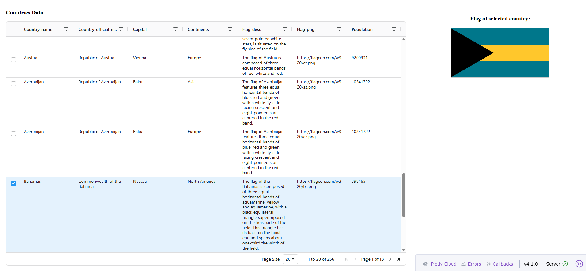

# Junior Data Engineer task - Country Data ETL & Storage & Visualization

This project consists of a complete ETL pipeline that fetches data from an external API, processes it using Python/Pandas, and stores it in a persistent PostgreSQL database running in a Docker container.
As the last step, the data is visualized via Dash (https://dash.plotly.com/).

## Project Structure
- `DataIngestion.py`: The core Python script for data retrieval, transformation, and database ingestion.
- `docker-compose.yaml`: Configuration file to spin up the PostgreSQL database environment.
- `.env`: Configuration file for sensitive credentials and specific settings.
- `countries_data.csv` file with transformed data for creating visualization (the file is the copy of what is placed into the database).
- `Visualization.py`: Python file for building visualization in Dash
- `requirements.txt`: List of Python dependencies required to run the project.

## Prerequisites
- **Python 3.x**
- **Docker Desktop** (must be running)
- **pip** (Python package manager)

## Setup and Installation

### 1. Clone or Download the Project
Extract the project files into your local directory.

### 2. Configure Environment Variables
Create a file named `.env` in the root directory and add the following variables:
```env
DB_USER=admin
DB_PASSWORD=mysecretpassword
DB_PORT=5433
```
Note: I have used port 5433 to avoid potential conflicts with local PostgreSQL instances typically running on port 5432.

### 3. Configure Environment Variables
Open your terminal/command line in the project root directory and run:
For Windows:
```env
pip install -r requirements.txt
```
For Mac/Linux:
```env
python3 -m venv venv
source venv/bin/activate
pip install -r requirements.txt
```
### 4. Start the Database using Docker
Run the following command from the project root directory to start the PostgreSQL container:
```env
docker-compose up -d
```
Note: For stopping container use the following command (the volume will be removed)
```env
docker compose down -v
```
## Data Ingestion

### 5. Run the Python script `DataIngestion.py` for data ingestion, transformation, and placing it into a database
Run the following command from the project root directory to run the script:
```env
python DataIngestion.py
```
To verify the data has been saved successfully, you can run this command in terminal (make sure the user name corresponds with what you have in `.env` file
```env
docker exec -it countries_data psql -U admin -d countries_db
```
After running the command above, In the command line you should see: countries_db=#. 
Add "\dt" to the command (countries_db=# \dt), so now you should see the table 'countries'. 
You are also able to query this table in the database to make sure the data is there.

## Data Visualization
This final stage of the project features an interactive monitoring dashboard built with Dash and AG Grid. The application allows users to explore processed country data, perform sorting, filtering, and view flags dynamically depending on the country row selected.
Note: Data is fetched based on the `countries_data.csv` file from project's GitHub repository for convenience purposes of this project.

### 6. Built Data Visualization (Dash App)
Note: All required Python packages have been already installed in step 3 using the provided requirements file.

Run the Python script `Visualization.py` from the project root directory:
```env
python Visualization.py
```
Once started, a local URL will appear in your terminal (typically http://127.0.0.1:8050). Copy and paste it into your web browser to view the dashboard.
You should see something similar to this:


